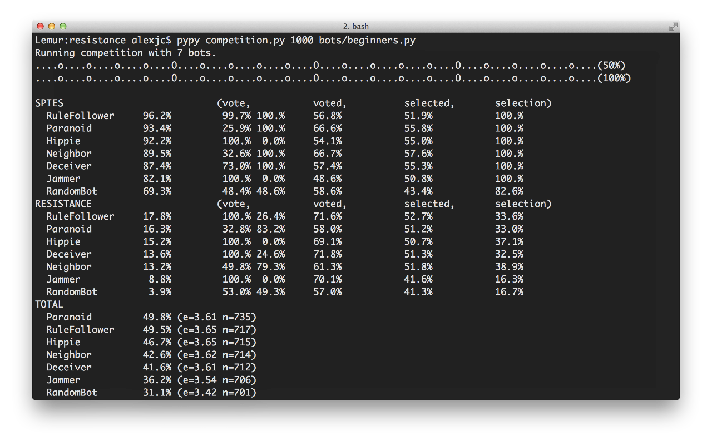

THE RESISTANCE AI
=================

Python framework for THE RESISTANCE board & card game, along with various AI bots submitted for the 2012 competition at the Game/AI Conference.

|Build Status|

----

Building Bots
-------------

To create your own bot, the best places to start are the following:

  1. **Interface** — The API you must implement is located in ``player.py``, specifically a class called ``Bot``.
  2. **Examples** — To find samples to learn from, see ``bots/beginners.py`` for some default behaviors.

Basically, you must implement functions for each of the key decisions the bot has to make in the game (e.g. ``select``, ``vote`` or ``sabotage``), and then have the option of overriding callback functions to get additional information (e.g. ``onMissionComplete``).

Each bot also has a ``self.game`` data-structure that stores information about the game itself.  The class this refers to is ``State`` at the top of ``game.py`` — which you should consult for details.

Running Competitions
--------------------

If you want to quickly stress test the code and evaluate performance, you can run long competitions of thousands of games.  This is done via the ``competition.py`` script in the root of the repository.

Launch a competition with bots from a relative path as follows::

    > python competition.py 1000 bots/beginners.py

Run a competition from a python module, assuming the path is set::

    > PYTHONPATH=bots python competition.py 1000 beginners.Hippie beginners.Paranoid

These standalone competitions run without dependencies, and also run with PyPy_ for additional performance.

The script outputs ranking tables with scores for resistance and spies separately as percentage of wins, then below they are combined.  The two ``vote`` columns track correct up-votes and correct down-votes, depending on whether it's spy or or resistance.  The ``voted`` column shows how often others supported a team including this player.  The ``selected`` column shown how often the player was selected, and ``selection`` tracks the picking of teams with or without spies (depending on role).

Interactive Play on IRC
-----------------------

If you want to interact with your bot for fun or testing, you can do this via Internet Relay Chat and the two scripts called ``client.py`` (to launch your bot) and ``master.py`` (to coordinate games).

Running interactive text-based games requires some dependencies, in particular for networking and IRC connection::

    > pip install twisted

Then you can run your bots by specifying them on the command-line, until you press CTRL+C::

    > python client.py bots/beginners.py --server=localhost
    CONNECTED Hippie.
    CONNECTED Neighbor.
    ^C
    DISCONNECT Neighbor.
    DISCONNECT Hippie.

To interact with them via IRC, connect your own IRC client and join the ``#resistance`` channel there.  You should see the bots listed in the users there.

If there's no master/moderator, another bot usually called ``aigamedev`` also visible in the user list, you'll need to launch it as follows::

    > python master.py --server=localhost

After this, you can launch a game within IRC by typing a message into the ``#resistance`` channel::

    [alexjc]    PLAY alexjc, Hippie, Paranoid, Deceiver, Random.
    [aigamedev] PLAYING alexjc Hippie Paranoid Deceiver Random!

Then you can follow the instructions within your IRC client to play the game itself.

.. |Build Status| image:: https://travis-ci.org/aigamedev/resistance.png?branch=master
   :target: https://travis-ci.org/aigamedev/resistance

.. _PyPy: http://pypy.org/
